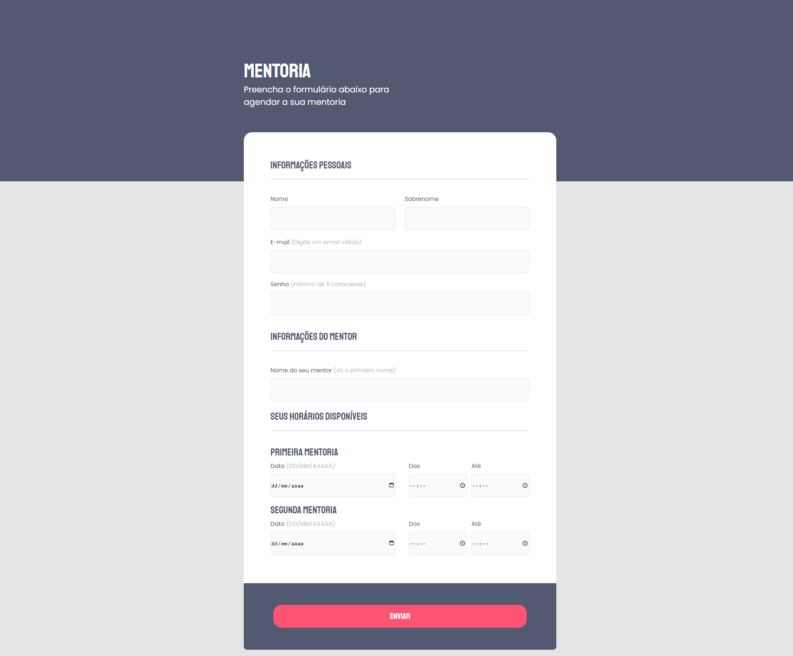

# Criando formulários
  Nesse desafio tivemos que criar um layout de um formulário e realizar suas validações.
  Ressalto informação que não tem envio de formulário e sim só criação de layout e estilização do formulário.
  

## 🔧 Tecnologies
- HTML5
- CCS3

## O que eu aprendi?
- Reset de CSS
- Usar elementos Fieldset, Input, select, label e checkbox
- Position com z-index:
  - Posicão de elementos eixos X, Y, Z.
    - eixo X é referente à coordenada horizontal
    - eixo Y referente a coordenada vertical.
    - eixo Z é responsável pelo cálculo e posicionamento da profundidade de um determinado elemento em relação à tela, se estará mais afastado ou mais próximo.
- Pseudo-element
- Validação de campos

## 💚 Contato
E-mail: e.rickilopova@hotmail.com

#NEVERSTOPLEARNING